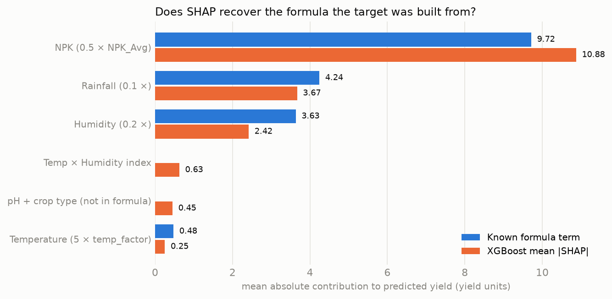
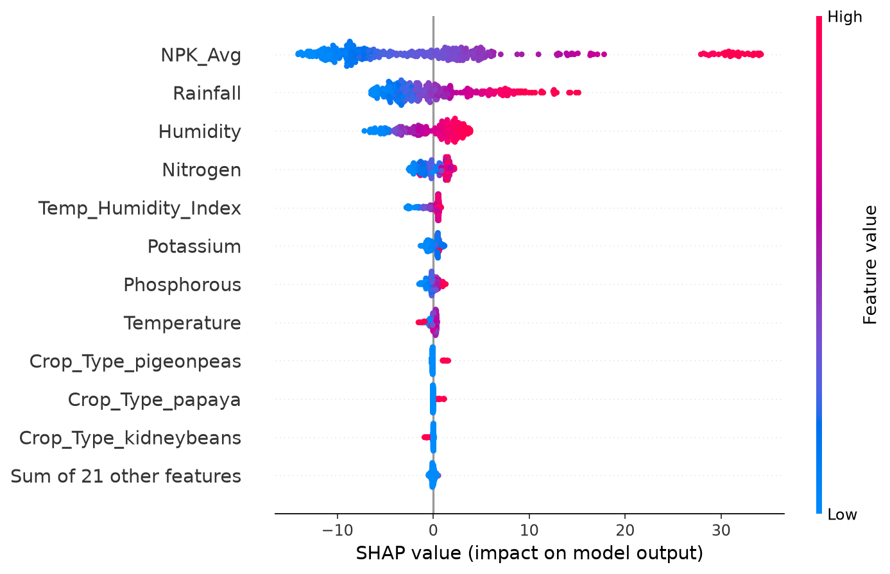

# Crop Recommendation & Explainable Yield Modelling

[](https://github.com/SASHI117/Crop_Prediction_Analysis/actions/workflows/ci.yml)
[](https://colab.research.google.com/github/SASHI117/Crop_Prediction_Analysis/blob/main/crop_prediction.ipynb)


Two tasks on 2,200 soil and weather measurements covering 22 crops:

1. **Crop recommendation.** Given N, P, K, temperature, humidity, pH and
   rainfall, which crops suit this field? Three classifiers are compared with
   stratified cross-validation.
2. **Yield regression with SHAP.** The dataset has no yield column, so the
   project defines a synthetic one. Because its true formula is known, the
   project can check whether SHAP explains the model *correctly*, not just
   plausibly.

```bash
pip install -r requirements.txt
python run_pipeline.py        # ~40 s on a laptop, writes reports/
pytest -q
```

## Results

### Crop recommendation (22 classes, 100 samples each)

| Model | CV accuracy (5-fold) | CV macro-F1 | Held-out accuracy |
|---|---|---|---|
| **Random forest** | **0.993 ± 0.005** | **0.993** | **0.993** |
| XGBoost | 0.990 ± 0.002 | 0.990 | 0.989 |
| Logistic regression | 0.968 ± 0.007 | 0.968 | 0.973 |

```python
>>> recommend(model, encoder, {"Nitrogen": 90, "Phosphorous": 42, "Potassium": 43,
...           "Temperature": 21.0, "Humidity": 82.0, "pH": 6.5, "Rainfall": 203.0})
[('rice', 0.95), ('jute', 0.047), ('papaya', 0.003)]
```

Even a linear model scores 97%, because each crop occupies a tight, largely
separate range of rainfall, humidity and nutrients in this dataset. That is a
property of the data, and real fields will overlap far more. The top-3
output with probabilities is more useful than a single label: "rice, or
possibly jute" is an honest recommendation.

### Yield regression — what the R² does and doesn't mean

```
yield = 0.5·NPK_Avg + 0.2·Humidity + 0.1·Rainfall + 5·temp_factor(T)
temp_factor = max(0, 1 − |T − 27 °C| / 28)
```

| Model (held-out 20%) | R² | RMSE | MAE |
|---|---|---|---|
| XGBoost (grid-searched, 5-fold CV R² 0.998) | 0.9978 | 0.726 | 0.551 |
| **Linear regression baseline** | **0.9992** | **0.432** | **0.311** |

The linear baseline **beats** tuned XGBoost. The target is linear apart from
the temperature term, so any R² near 1 only shows that the pipeline recovers
the formula the target was built from. It isn't evidence that the model
predicts yield. An earlier version of this README reported R² 0.9976 as
"excellent performance". The baseline is there to prevent that reading.

### Does SHAP recover the formula?

The contribution of each term to the target is known exactly, so mean |SHAP|
per term can be compared with the truth:



- **The ranking is right**: NPK > rainfall > humidity > temperature, the
  same order as the true contributions.
- **The magnitudes aren't.** Humidity gets two-thirds of its true credit,
  and the rest leaks into the correlated temperature×humidity index. pH and
  crop type, which aren't in the formula at all, pick up a small spurious
  share. The five nutrient features are collinear (`Total = N + P + K`,
  `Avg = Total/3`), so XGBoost splits the NPK credit among them
  arbitrarily. Summing absolute values across them also overstates the
  group slightly.
- **Takeaway:** SHAP on correlated, engineered features is reliable for
  *which* inputs matter and less reliable for *how much*. Removing
  redundant features, or grouping them before explaining, gives cleaner
  attributions.



The isolated cluster at +30 on `NPK_Avg` is apple and grapes, the only crops
grown at potassium ≈ 200 in this data.

## Pipeline


| Path | |
|---|---|
| `crop_analysis/features.py` | loading and validation, derived features, the synthetic target, fertility tertiles |
| `crop_analysis/recommend.py` | classifier comparison and top-k recommendation |
| `crop_analysis/yield_model.py` | regression, linear baseline, SHAP and ground-truth comparison |
| `run_pipeline.py` | runs everything and writes `reports/metrics.json`, figures, `crop_predictions.csv` |
| `crop_prediction.ipynb` | executed walkthrough (local or Colab) |
| `tests/` | 8 tests. CI also runs the full pipeline and executes the notebook |

## Engineering notes (fixes from the first version)

- **SHAP explained the wrong preprocessor.** The original notebook called
  `preprocessor.fit_transform(X)` on the unfitted template it had passed to
  `GridSearchCV` (which trains a clone). It also plotted unnamed columns. The
  explainer now uses the fitted preprocessor from the best pipeline and
  `get_feature_names_out()`.
- **Leakage.** `Moisture_norm` min-max scaled rainfall with statistics from
  the full dataset, test rows included, and duplicated rainfall after
  standard scaling. It has been removed. All remaining derived features are
  row-wise, and a test checks that.
- **Tuning on the training split only**, with shuffled 5-fold CV. The split
  is stratified by crop.
- The notebook no longer depends on `google.colab` file upload/download.

## Data

[Crop Recommendation Dataset](https://www.kaggle.com/datasets/atharvaingle/crop-recommendation-dataset)
(Kaggle): 22 crops × 100 rows of N, P, K (ratios), temperature (°C),
relative humidity (%), soil pH and rainfall (mm). It is a curated
benchmark with no missing values or duplicates, not raw field data.

## Limitations

- There is no real yield data. The regression task demonstrates modelling
  and explanation methodology, not agronomy.
- The recommendation accuracy reflects a clean, well-separated benchmark.
  A field deployment would need regional data, soil-test noise, and
  economic constraints such as market price and water availability.

## License

MIT
