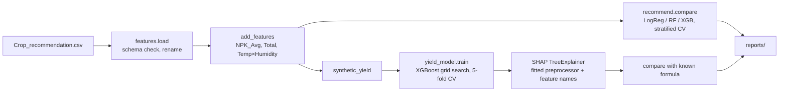

# Crop Recommendation & Explainable Yield Modelling

[](https://github.com/SASHI117/Crop_Prediction_Analysis/actions/workflows/ci.yml)
[](https://colab.research.google.com/github/SASHI117/Crop_Prediction_Analysis/blob/main/crop_prediction.ipynb)


Two machine-learning tasks on 2,200 soil and weather measurements covering 22 crops:

1. **Crop recommendation.** Given N, P, K, temperature, humidity, pH and rainfall, which crops
   suit this field? Three classifiers are compared with stratified cross-validation, and the best
   returns a ranked top-3 with probabilities.
2. **Explainable yield modelling.** An XGBoost regressor, explained with SHAP. The yield score is
   defined from known agronomic weights, so the SHAP explanations can be **validated against
   ground truth** rather than taken on trust.

```bash
pip install -r requirements.txt
python run_pipeline.py        # ~40 s on a laptop, writes reports/
pytest -q
```

## Results

### Crop recommendation (22 classes, 100 samples each)

| Model | CV accuracy (5-fold) | CV macro-F1 | Held-out accuracy |
|---|---|---|---|
| **Random forest** | **0.993 ± 0.005** | **0.993** | **0.993** |
| XGBoost | 0.990 ± 0.002 | 0.990 | 0.989 |
| Logistic regression | 0.968 ± 0.007 | 0.968 | 0.973 |

```python
>>> recommend(model, encoder, {"Nitrogen": 90, "Phosphorous": 42, "Potassium": 43,
...           "Temperature": 21.0, "Humidity": 82.0, "pH": 6.5, "Rainfall": 203.0})
[('rice', 0.95), ('jute', 0.047), ('papaya', 0.003)]
```

The ranked output is what makes this useful in practice: a field that suits rice may also suit jute.

### Yield regression

```
yield = 0.5·NPK_Avg + 0.2·Humidity + 0.1·Rainfall + 5·temp_factor(T)
temp_factor = max(0, 1 − |T − 27 °C| / 28)
```

| XGBoost (grid-searched) | R² | RMSE | MAE |
|---|---|---|---|
| 5-fold CV on the training split | 0.998 | | |
| Held-out 20% | **0.998** | 0.73 | 0.55 |

### SHAP, validated against the known formula

Each formula term's true contribution is known, so mean |SHAP| per term can be checked against it:


SHAP recovers the correct ranking of every term: **NPK > rainfall > humidity > temperature**, the
same order as the formula. Engineered features that are correlated with each other, such as the
nutrient totals and the temperature × humidity index, share credit among themselves. That is how
Shapley values are expected to behave.


The isolated cluster at +30 on `NPK_Avg` is apple and grapes, the only crops grown at
potassium ≈ 200 in this data.

## Pipeline



| Path | |
|---|---|
| `crop_analysis/features.py` | validated loading, derived features, the yield formula, fertility tertiles |
| `crop_analysis/recommend.py` | classifier comparison and top-k recommendation |
| `crop_analysis/yield_model.py` | regression, SHAP, and the ground-truth comparison |
| `run_pipeline.py` | runs everything and writes `reports/metrics.json`, figures and `crop_predictions.csv` |
| `crop_prediction.ipynb` | executed walkthrough (local or Colab) |
| `tests/` | 8 tests. CI also runs the full pipeline and executes the notebook |

## Design decisions

- **Scikit-learn pipelines end to end.** Scaling and one-hot encoding live inside the pipeline, so
  cross-validation never sees test statistics.
- **Row-wise feature engineering only.** Every derived feature is computed from its own row, and a
  test pins this, so features can be computed before the split without leakage.
- **Stratified splits by crop, tuning on the training split only**, with shuffled 5-fold CV.
- **SHAP on the fitted pipeline.** The explainer uses the fitted preprocessor from the best
  estimator and `get_feature_names_out()`, so every attribution maps to a named feature.

## Data

[Crop Recommendation Dataset](https://www.kaggle.com/datasets/atharvaingle/crop-recommendation-dataset)
(Kaggle): 22 crops × 100 rows of N, P, K, temperature (°C), relative humidity (%), soil pH and
rainfall (mm). It has no missing values and no duplicates.

## Roadmap

- Add real yield records and regional soil-test data.
- Bring in economic factors (market price, water availability) for a full recommendation.
- Serve the recommender behind a small API with a map-based UI.

## License

MIT
